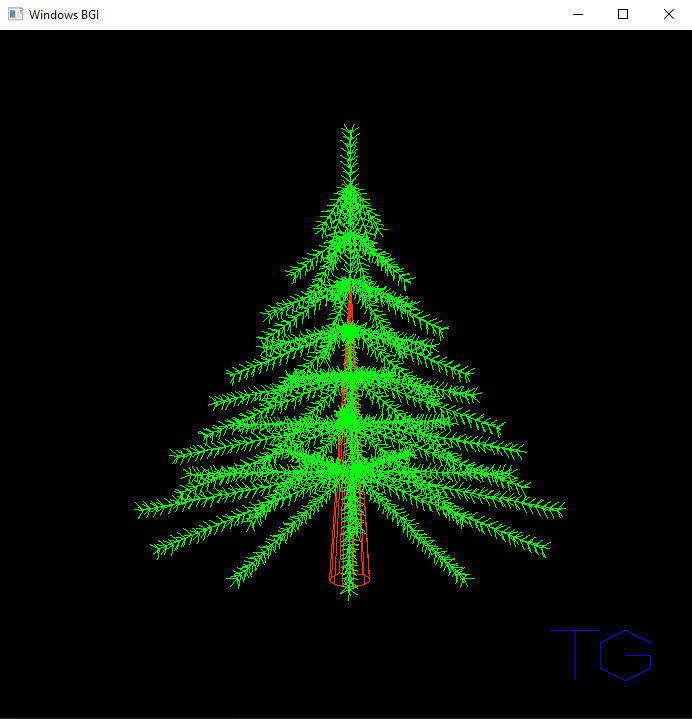
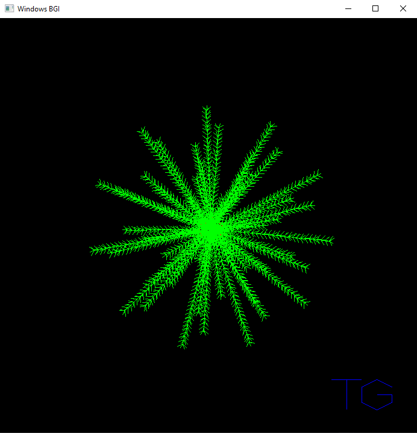
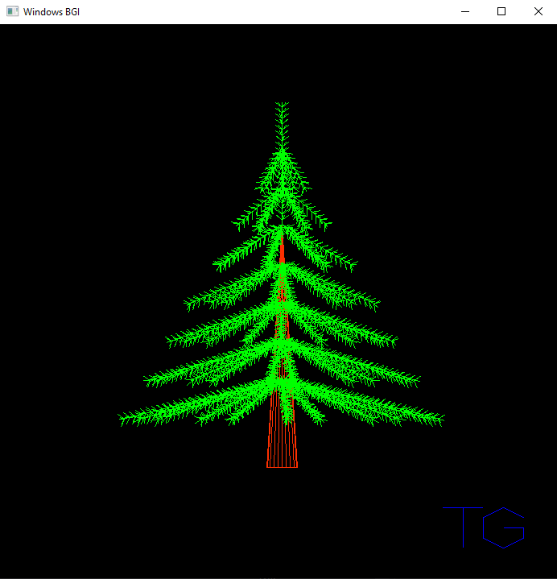
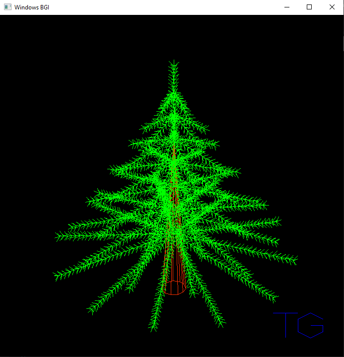

# Christmas_tree_2014
Program with procedurally generating algorithm for a Christmas tree model. The model can be shown in different geometric projection.

## Instruction
- Download and unpack _Christmas_tree.zip_ archive, then run the file _Grafika.exe_
 

  
   
  

